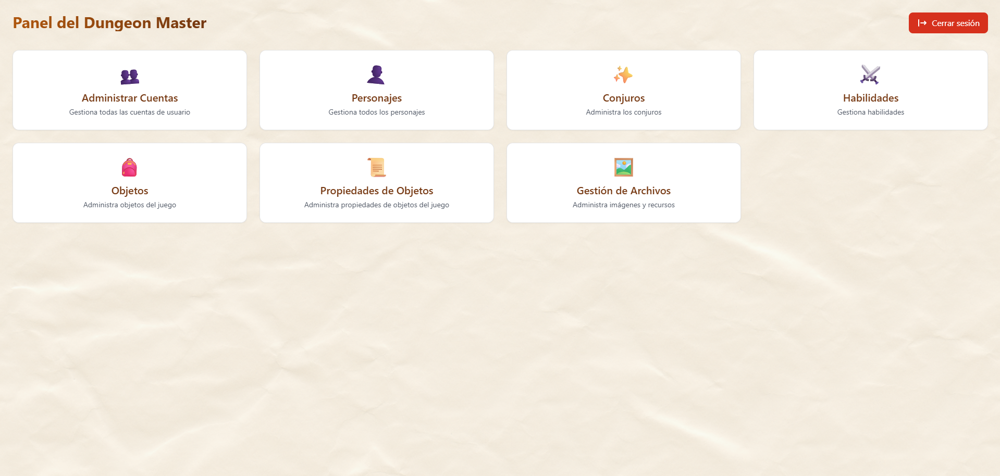

# RolUp

RolUp es un proyecto personal que nace de una idea que tuve con mis amigos. Nosotros somos un grupo de cuatro que a veces se reúne para jugar D&D y siempre hemos tenido algunos problemas a la hora de gestionar nuestras partidas: ¿querías saber cuál era tu modificador de Fuerza? Tenías que irte a la página de estadísticas de un excel; ¿cuáles eran tus conjuros? Tenías que irte a ese mismo excel a la sección de conjuros y seguir un enlace para consultarlo, ¿cuál era la habilidad de clase que ganabas a nivel 6? Tocaba irse a un pdf...

Con toda la información distribuida en decenas de archivos mientras preparaba algunas cosas para una campaña pensé "soy estudiante de ingeniería informática, he dado una asignatura que enseña a hacer aplicaciones web, ¿por qué no creo una aplicación para poder jugar más cómodamente y que se adapte a nuestras necesidades?".

Por supuesto que investigué si ya existían propuestas interesantes para resolver nuestros problemas, pero ninguna terminaba de encajar con nuestro estilo de juego altamente flexible, por lo que luego de comentar la idea de crear una aplicación con mis amigos a todos les gustó la propuesta y dieron sus ideas (ellos son los jugadores y yo el Dungeon Master, por lo que su feedback es muy importante ya que ellos serán los "usuarios finales").

Luego de consultar la viabilidad de realizar un proyecto así con mi profesor (ya que este proyecto es mucho más complejo que lo aprendido en la asignatura) vi que realizarlo era completamente posible, con algo más de investigación por supuesto, por lo que me puse manos a la obra en verano tabajando poco a poco hasta terminar la versión 1.0.0 de RolUp.

RolUp es una aplicación web diseñada como herramienta de apoyo para jugar rol de mesa de forma presencial. Permite gestionar personajes, inventario, habilidades, conjuros y, próximamente, encuentros de combate con turnos, efectos y reparto de recompensas. La versión 1.0.0 (la actual) se centra en la API, mientras que la 2.0.0 integrará websocket para manejar estos encuentros.

El proyecto está pensado para jugar con amigos en tiempo real en la red local de una casa, con una máquina que haga de servidor y el resto conectándose con el móvil (u otros equipos). No es una aplicación comercial ni un trabajo serio que quiera compartir para que otras personas lo usen: es una solución a un problema de gestión de partidas de D&D para mi grupo de amigos, por lo que es muy específica para nosotros.

Si no pretendo distribuir esta aplicación, entonces ¿cuál es la razón por la que he creado un repositorio de GitHub? Pricipalmente porque:
-  Me permitirá controlar las versiones del proyecto (lo cual es útil).
-  Si en un futuro me dedico al desarrollo de software tener mi propio proyecto documentado ya me habrá dado algo de experiencia.
-  Quería enseñarle lo lejos que ha llegado esta idea a mi profesor y quizá pueda ser la base de mi TFG, al menos me ha dado mucho conocimiento para hacer un TFG relacionado con la creación de aplicaciones web.

Así pues, siendo la documentación una parte muy importante del desarrollo de software, daré más detalles de este proyecto (no una guía de cómo se usa a nivel de usuario sino algo más técnico centrándose en las herramientas):

---

## Tecnologías utilizadas

- **Backend:** Java con Spring Boot
- **Frontend:** React con Vite (me costó decidir entre React y Angular)
- **Base de datos:** PostgreSQL (con Docker)
- **Gestión de dependencias y compilación del backend:** Maven
- **Gestión del frontend:** Node.js y npm

---

## Estructura del proyecto

```bash
RolUp/
├─ backend/   # Código Java/Spring Boot
├─ frontend/  # Código React + Vite
├─ docker/    # Docker Compose para PostgreSQL
└─ run.ps1    # Script para arrancar y detener todos los servicios
```

---

## Requisitos para ejecutar el proyecto

Para poder ejecutar RolUp en una máquina Windows necesitas tener instalados:

1. **Java JDK 17 o superior** (para Spring Boot en el backend)  

2. **Maven** (para compilar y ejecutar el backend)  

3. **Node.js y npm** (para ejecutar el frontend con Vite)  

4. **Docker Desktop** (para ejecutar PostgreSQL en un contenedor)  

Asegúrate de que los comandos `java`, `mvn`, `node`, `npm` y `docker` estén accesibles desde la terminal (agregados al PATH).

---

## Cómo ejecutar RolUp

Se ha incluido un script de PowerShell (`run.ps1`) que arranca todos los servicios necesarios: base de datos, backend y frontend.

1. Abre **PowerShell** en la carpeta raíz del proyecto (`RolUp`).
2. Ejecuta:

```powershell
.\run.ps1
```

3. El script realizará lo siguiente:

    - Arranca PostgreSQL mediante Docker Compose.
    - Espera unos segundos para que la base de datos inicialice.
    - Arranca el backend (Spring Boot) y el frontend (Vite + React) en la misma consola.
    - Se quedará esperando a que escribas "exit".
    - Cuando escribas "exit", el script se encargará de detener backend, frontend y apagar el contenedor de PostgreSQL.

## Notas adicionales

- La primera vez que ejecutes el script, asegúrate de tener permisos para ejecutar scripts de PowerShell. Si es necesario, puedes habilitarlos con:

```powershell
- Set-ExecutionPolicy -ExecutionPolicy RemoteSigned -Scope Process
```

- Los datos se guardan en un volumen gestionado por Docker (`postgres_data`).  
Esto significa que se mantienen incluso si detienes los contenedores, pero **no están en una carpeta accesible del proyecto**.

- Para **exportar** la base de datos, ejecuta dentro de la carpeta **docker**:
```bash
docker exec -t postgres_db pg_dump -U admin rolup > backup.sql
```
- Para **importar** la base de datos a otra máquina, ejecuta el siguiente comando dentro de la carpeta **docker**:
```bash
Get-Content backup.sql | docker exec -i postgres_db psql -U admin -d rolup
```

- El par usuario contraseña del administrador es DM/DM. No parece lo más seguro del mundo, pero confío en que mis jugadores no intentarán usar mi cuenta (¿por qué lo harían? se estarían comiendo spoilers y ellos al igual que yo queremos divertirnos). Esta aplicación está pensada para montarse en una red local, no habrá intrusos procedentes de internet. Igualmente, si hay alguien que quiere usar esta aplicación y te preocupa que los jugadores entren en la cuenta del DM siempre puedes cambiar tu contraseña desde el panel del Dungeon Master.

- Es posible que esté olvidando documentar algo, pero como es un proyecto personal no le daré mucha importancia.

## Algunas capturas

### Landing Page


### Panel del DM


### Formulario de creación de un conjuro


### Asignar un conjuro a un personaje


### Home Page de un jugador


### Hoja de personaje


### Inventario


### Habilidades


### Conjuros


### Detalles de un conjuro
